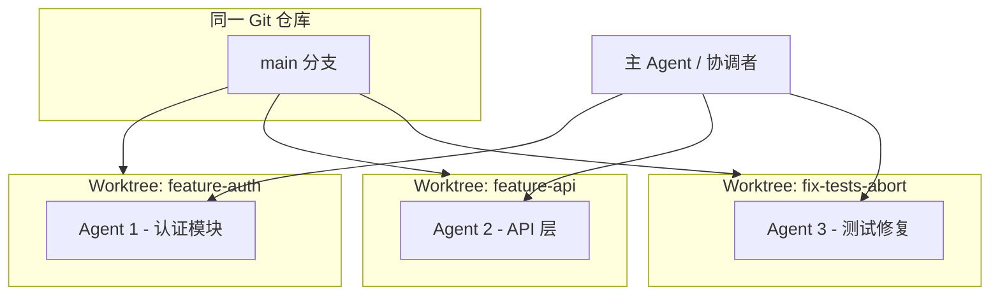

# 多 Agent 并行开发：Git Worktree 隔离与分支操作实践

当多个 AI Agent 同时处理不同功能、不同测试文件或不同子系统时，最大的风险不是「慢」，而是**互相踩踏**——改同一批文件、污染同一工作区、分支切换导致未保存状态丢失。Git Worktree 是在单仓库内为每个 Agent 提供**独立 checkout** 的标准解法，也是 [Superpowers](https://github.com/obra/superpowers) 方法论中「并行分支准备」阶段的核心 Git 操作。

> 对应 source 母本：`skills/source/using-git-worktrees.md`

## 为什么需要 Worktree，而不是切分支

传统做法是 `git checkout -b feature-a` 再 `git checkout -b feature-b`，但 Agent 会话是**并发**的：

| 方式 | 问题 |
|---|---|
| 同一目录切分支 | Agent A 改到一半，Agent B 切分支会打断 A 的文件状态 |
| 克隆多份仓库 | 磁盘占用大，远程同步、依赖安装重复 |
| **Git Worktree** | 同一 `.git`，多个工作目录，各 Agent 各干各的 |

Worktree 的本质：`git worktree add <path> -b <branch>` 在指定路径创建一个新 checkout，共享对象库，分支与文件系统完全隔离。

## 多 Agent 并行的典型架构



**协调者 Agent** 负责拆分任务、分发子 Agent、汇总结果；**执行 Agent** 各自在独立 worktree 中读写代码，互不干扰。

这与 Superpowers 的 `dispatching-parallel-agents` 技能配合：每个独立问题域（不同测试文件、不同子系统）派一个 Agent，前提是他们**不共享可变状态**。

## 标准操作流程

### 1. 设计确认后再隔离

Worktree 不是第一步。Superpowers 工作流要求先完成 `brainstorming`（需求澄清与设计文档），再进入 `using-git-worktrees`。避免在方向未定时就创建多个孤立分支，增加合并成本。

### 2. 检测是否已在隔离环境

创建前必须检测：

```bash
GIT_DIR=$(cd "$(git rev-parse --git-dir)" 2>/dev/null && pwd -P)
GIT_COMMON=$(cd "$(git rev-parse --git-common-dir)" 2>/dev/null && pwd -P)
```

- `GIT_DIR != GIT_COMMON` → 已在 linked worktree，**禁止再嵌套创建**
- 还需排除 git 子模块误判（子模块同样满足上述不等式）

### 3. 选择 Worktree 目录

优先级：

1. 用户/项目配置中声明的目录
2. 项目内已有 `.worktrees/` 或 `worktrees/`
3. 全局路径 `~/.config/superpowers/worktrees/<project>/`
4. 默认 `.worktrees/`

**关键安全步骤**：项目本地目录必须被 `.gitignore` 忽略：

```bash
git check-ignore -q .worktrees || echo "需要先加入 .gitignore"
```

否则 worktree 内的 `node_modules`、构建产物等可能被误提交。

### 4. 创建 Worktree 与分支

```bash
# 为 Agent 1 创建认证功能分支
git worktree add .worktrees/feature-auth -b feature/auth

# 为 Agent 2 创建 API 功能分支
git worktree add .worktrees/feature-api -b feature/api

# 进入对应目录开始工作
cd .worktrees/feature-auth
```

每个 Agent 会话绑定一个 worktree 路径 + 一个 feature 分支。

### 5. 依赖安装与基线测试

进入 worktree 后，自动检测项目类型并安装依赖（`npm install` / `cargo build` / `poetry install` 等），然后跑全量测试确认**基线干净**：

```bash
npm test   # 或项目对应命令
```

基线失败时，协调者应暂停分发任务，先排查是环境问题还是仓库本身有回归。否则 Agent 修的新 bug 和旧 bug 无法区分。

### 6. 并行执行与汇总

协调者按独立域分发任务，每个子 Agent 的 prompt 应包含：

- **明确范围**：一个测试文件 / 一个子系统
- **自包含上下文**：错误信息、目标文件路径、约束条件
- **输出要求**：根因摘要 + 改动说明

子 Agent **不应继承**协调者的完整会话历史，只拿完成任务所需的最小上下文。

### 7. 合并与清理

所有 Agent 完成后：

1. 协调者 review 各 Agent 摘要，检查文件冲突
2. 在各 worktree 跑测试
3. 按 `finishing-a-development-branch` 流程决定 merge / PR / 丢弃
4. 清理 worktree：

```bash
git worktree remove .worktrees/feature-auth
git branch -d feature/auth   # 已合并后
```

## 平台原生 Worktree vs 手动 Git

Cursor 等平台可能提供原生 worktree 能力（如 `EnterWorktree`、`--worktree` 参数）。**规则：有原生工具就用原生，不要手动 `git worktree add`。**

原因：平台 harness 能追踪原生 worktree 的生命周期；手动创建的状态平台看不见，容易造成 phantom worktree，清理时遗漏。

检测顺序：**已有隔离 → 原生工具 → git fallback**。

## 何时该并行，何时不该

**适合并行 + Worktree：**

- 3+ 个测试文件失败，根因彼此独立
- 多个子系统各自损坏，修复无依赖
- 多个功能模块可独立交付

**不适合：**

- 失败可能同源（修一个可能修全部）
- Agent 会编辑同一文件
- 需要先理解全局状态才能动手
- 探索性调试，问题域尚不明确

## 与 Superpowers 工作流的位置

```
brainstorming → using-git-worktrees → writing-plans → executing-plans
                              ↓
              dispatching-parallel-agents（可选，多域并行）
                              ↓
         test-driven-development → requesting-code-review
                              ↓
              finishing-a-development-branch（含 worktree 清理）
```

Worktree 是**空间隔离**；`dispatching-parallel-agents` 是**任务分发**。两者组合才是完整的多 Agent 并行开发模式。

## 安装与引用

```bash
npx skills add https://github.com/obra/superpowers --skill using-git-worktrees
```

- 技能页面：[skills.sh/obra/superpowers/using-git-worktrees](https://www.skills.sh/obra/superpowers/using-git-worktrees)
- 仓库母本：[github.com/obra/superpowers](https://github.com/obra/superpowers)
- 本仓库 source 母本：`skills/source/using-git-worktrees.md`

## 快速决策表

| 场景 | 动作 |
|---|---|
| 已在 linked worktree | 跳过创建，直接 setup + 测基线 |
| 平台有原生 worktree 工具 | 用原生，勿手动 git |
| 多 Agent 改不同模块 | 每 Agent 一个 worktree + 分支 |
| `.worktrees/` 未 ignore | 先写 `.gitignore` 再创建 |
| 基线测试失败 | 暂停分发，先排查 |
| 开发完成 | merge/PR 后 `git worktree remove` |
